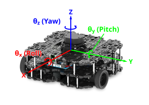
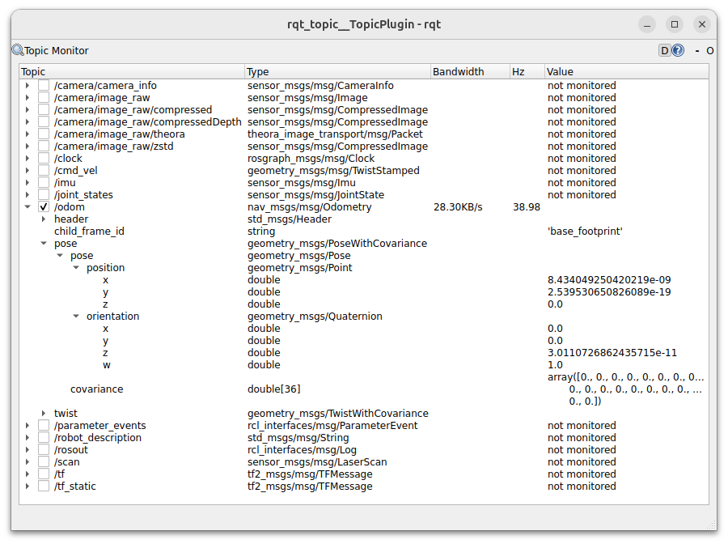
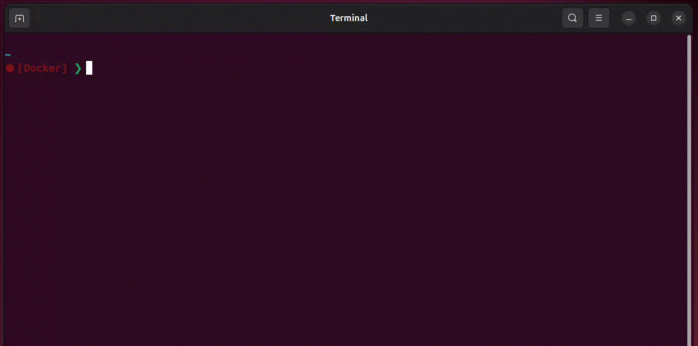
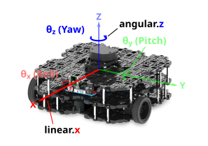

---  
title: "Lab 2: Odometry & Navigation"  
description: Learn about Odometry, which informs us of a robot's position and orientation in an environment. Apply both open and closed-loop velocity control methods to a Waffle. 
---

## Introduction

In Lab 2 we'll learn how to control a ROS robot's **position** and **velocity** from both the command line and through ROS Nodes. We'll also learn how to interpret the data that allows us to monitor a robot's position in its physical environment (odometry).  The things covered here form the basis of robot navigation in ROS, from simple open-loop methods to more advanced closed-loop control (both of which we will explore).

## Getting Started

**Step 1: Launch your ROS 2 Environment**

You should now have access to ROS 2 via a Linux terminal instance. We'll refer to this terminal instance as **TERMINAL 1**.


**Step 2: Launch VS Code** 

It's also worth launching VS Code now, so that it's ready to go for when you need it later on. 


**Step 3: Make Sure The Course Repo is Up-To-Date**

<a name="course-repo"></a>

In Lab 1 you should have [downloaded and installed The Course Repo](./part1.md#course-repo) into your ROS environment. If you haven't done this yet then go back and do it now. If you *have* already done it, then it's worth just making sure it's all up-to-date, so run the following command in **TERMINAL 1** now to do so:

```bash
cd ~/ros2_ws/src/ros/ && git pull
```

Then build with Colcon: 

```bash
cd ~/ros2_ws/ && colcon build --packages-up-to ros
```

And finally, re-source your environment:

```bash
source ~/.bashrc
```

!!! warning
    If you have any other terminal instances open, then you'll need run `source ~/.bashrc` in these too, in order for any changes made by the Colcon build process to propagate through to these as well.

**Step 4: Launch a Waffle Simulation**

In **TERMINAL 1** enter the following command to launch a simulation of a TurtleBot3 Waffle in an empty world:  
        
```bash
ros2 launch turtlebot3_gazebo empty_world.launch.py
```

A Gazebo simulation window should open and within this you should see a TurtleBot3 Waffle in empty space.


## Odometry {#odometry}

Odometry is a process of monitoring a robot's *position* and *orientation* in an environment, which is essential for robot navigation. The position and orientation of a robot is referred to as its *pose*. A robot's pose is 3-dimensional, and is therefore defined in terms of three *"Principal Axes"*: `X`, `Y` and `Z`. In the context of our TurtleBot3 Waffles, these axes and the motion about them are defined as follows:

<a name="principal-axes"></a>

<figure markdown>
  {width=800}
</figure>

Not all the above positions and orientations apply to our Waffles, and we'll explore this further below.

### Odometry In Action

Recall from Part 1 the command that we can use to list *all* the topics that are available on our robot:

```bash
ros2 topic list
```

You should see `/odom` in this list, which is where our robot's Odometry data is published. Run the `ros2 topic` command again, but this time with an additional `-t` option:

```bash
ros2 topic list -t
```

Look for `/odom` again in the list, and you will *now* notice that the interface definition is provided in square brackets alongside the topic name:

``` { .txt .no-copy }
/odom [nav_msgs/msg/Odometry]
```

Having established the data structure, let's explore the actual data now, using `rqt`.

#### Exercise 1: Exploring Odometry Data {#ex1}

1. In a new terminal instance (**TERMINAL 2**) use the following command to launch the *RQT Topic Monitor*:

    ```bash
    ros2 run rqt_topic rqt_topic 
    ```

    *Topic Monitor* should launch with a list of active topics matching the topic list from the `ros2 topic list` command that you ran earlier.

1. Check the box next to `/odom` and click the arrow next to it to expand the topic and reveal four *base fields*.

1. Expand the `pose` field, and then the further `pose` field within that. This should reveal two further fields: **`position`** and **`orientation`**. 

    Expand both of these to reveal the data being published to the *three* position (`x`, `y` and `z`) and *four* orientation (`x`, `y`, `z` and `w`) values.

    <figure markdown>
      {width=600}
    </figure>

1. Next, launch a new terminal instance, we'll call this one **TERMINAL 3**. Arrange this next to the `rqt` window, so that you can see them both side-by-side.

1. In **TERMINAL 3** launch the `teleop_keyboard` node [as you did in Part 1](./part1.md#teleop): <a name="teleop"></a>

    ```bash
    ros2 run turtlebot3_teleop teleop_keyboard
    ```

1. Enter ++a++ a couple of times to make the robot rotate on the spot. Observe how the odometry data changes in Topic Monitor.


1. Now press the ++s++ key to halt the robot, then press ++w++ a couple of times to make the robot drive forwards.


1. Now press ++d++ a couple of times and your robot should start to move in a circle.

    
1. Press ++s++ in **TERMINAL 3** to stop the robot (but leave the `teleop_keyboard` node running).  Then, press ++ctrl+c++ in **TERMINAL 2** to close down `rqt`. 

1. Let's look at the Odometry data differently now. With the robot stationary, use `ros2 run` (in **TERMINAL 2**) to run a Python node from the `examples` package: 

    ```bash
    ros2 run examples robot_pose.py
    ```
        
1. Now (using the `teleop_keyboard` node in **TERMINAL 3**) drive your robot around again, keeping an eye on the outputs that are being printed by the `robot_pose.py` node in **TERMINAL 2** as you do so.

    The output of the `robot_pose.py` node shows you how the robot's *position* and *orientation* (i.e. *"pose"*) are changing in real-time as you move the robot around. The `"initial"` column tells us the robot's pose when the node was first launched, and the `"current"` column show us what its pose currently is. The `"delta"` column then shows the difference between the two.
    
    
1. Press ++ctrl+c++ in **TERMINAL 2** and **TERMINAL 3**, to stop the `robot_pose.py` and `teleop_keyboard` nodes. 

### Odometry Explained

Hopefully you're starting to understand what Odometry is now, but let's dig a little deeper using some key ROS command line tools again. IN **TERMINAL 2**:

```bash
ros2 topic info /odom
```

This provides information about the interface used by this topic:

``` { .txt .no-copy }
Type: nav_msgs/msg/Odometry
```

We can find out more about this interface using the `ros2 interface show` command:

```bash
ros2 interface show nav_msgs/msg/Odometry
```

Look down the far left-hand side to identify the four *base fields* of the interface (the fields that are not indented):

<a name="odom-base-fields"></a>

<center>

| # | Field *Name* | Field *Type* |
| :---: | :---: | :---: |
| 1 | `header` | `std_msgs/Header` |
| 2 | `child_frame_id` | `string` |
| **3** | **`pose`** | **`geometry_msgs/PoseWithCovariance`** |
| 4 | `twist` | `geometry_msgs/TwistWithCovariance` |

</center>

We saw all these in `rqt` earlier. As before, its item 3 that's of most interest to us...

#### Pose

``` { .txt .no-copy }
# Estimated pose that is typically relative to a fixed world frame.
geometry_msgs/PoseWithCovariance pose
        Pose pose
                Point position
                        float64 x
                        float64 y
                        float64 z
                Quaternion orientation
                        float64 x
                        float64 y
                        float64 z
                        float64 w
        float64[36] covariance
```

Within the `pose` base field we have two subfields: `pose` and `covariance`:

<center>

| # | Field *Name* | Field *Type* |
| :---: | :---: | :---: |
| **1** | **`pose`** | **`Pose`** |
| 2 | `covariance` | `float64[36]` |

</center>

It's the `pose` subfield that we're most interested in here, which contains two *further* subfields called `position` and `orientation`: 

<center>

| # | Field *Name* | Field *Type* |
| :---: | :---: | :---: |
| 1 | `position` | `Point` |
| 2 | `orientation` | `Quaternion` |

</center>

1. `position`
    
    Tells us where our robot is located in 3-dimensional space. This is expressed in units of **meters**.

1. `orientation`

    Tells us which way our robot is pointing in its environment. This is expressed in units of **Quaternions**, which is a mathematically convenient way to store data related to a robot's orientation (it's a bit hard for us humans to understand and visualise this though, so we'll talk about how to convert it to a different format later).

Pose is defined relative to an arbitrary reference point, typically where the robot was when it was turned on, or the origin of a simulated world. On our real TurtleBot3 Waffle robots, it is determined from:

* Data from the Inertial Measurement Unit (IMU) on the OpenCR board
* Data from both the left and right wheel encoders
* A *kinematic model* of the robot

All the above information can then be used to calculate (and keep track of) the distance travelled by the robot from its pre-defined reference point using a process called *"dead-reckoning."*

#### What are Quaternions?

Quaternions represent the orientation of something in 3 dimensional space[^quaternions], as we can observe from the structure of the `nav_msgs/msg/Odometry` ROS interface, there are **four fields** associated with this:

[^quaternions]: [Quaternions are explained very nicely here](https://automaticaddison.com/how-to-convert-a-quaternion-to-a-rotation-matrix/#What_is_a_Quaternion){target="_blank"}, if you'd like to learn more.

``` { .txt .no-copy }
Quaternion orientation
        float64 x
        float64 y
        float64 z
        float64 w
```

For us, it's easier to think about the orientation of our robot in a *"Euler Angle"* representation, which tell us the degree of rotation about the *three principal axes* ([as discussed above](#principal-axes)):

* $\theta_{x}$: The angular position about the **X**-axis, aka **"Roll"**
* $\theta_{y}$: The angular position about the **Y**-axis, aka **"Pitch"**
* $\theta_{z}$: The angular position about the **Z**-axis, aka **"Yaw"**

Fortunately, the maths involved in converting between these two orientation formats is fairly straight forward. The angular position about the Z-axis (aka "Yaw"), for example, is calculated as follows: 

$$
\theta_{z} = \operatorname{atan2}\left( 2(wz + xy), 1 - 2(y^2 + z^2) \right)
$$

Where $\theta_{z}$ is the yaw angle (in radians), and $w$, $x$, $y$ and $z$ are the quaternion components of a robot's orientation $w$ being the scalar (real) part and $x$, $y$ and $z$ being the vector parts.


### Which Pose Values Apply to our Waffles?

Referring back to the three *principal axes* from earlier: 

<figure markdown>
  {width=500}
</figure>

You can also see here that our TurtleBot3 has two motors that allow it to move. As a result of this, it can only move in a 2D plane and so its pose can be fully represented by just 3 odometry terms in total: 

* $x$ & $y$: the 2D coordinates of the robot in the **X**-**Y** plane
* $\theta_{z}$: the angle of the robot about the **Z**-axis (*yaw*)

(unfortunately, it can't fly!)

### Odometry Data as a Feedback Signal

Odometry data can be really useful for robot navigation, allowing us to keep track of where a robot is, how it's moving and how to get back to where we started. We therefore need to know how to use this data effectively within our Python nodes, and we'll explore this now.

#### Exercise 2: Creating a Python Node to Process Odometry Data {#ex2}

In Lab 1 we learnt how to create a package and build simple Python nodes to publish and subscribe to messages on a topic. In this exercise we'll build a new subscriber node, much like we did previously, but this one will subscribe to the `/odom` topic that we've been talking about above. We'll also create a new package called `part2_navigation` for this node to live in!

1. First, head to the `src` directory of your ROS 2 workspace in **TERMINAL 2**:

    ```bash
    cd ~/ros2_ws/src/
    ```

1. Clone the ROS 2 Package Template:

    ```bash
    git clone https://github.com/tom-howard/ros2_pkg_template.git
    ```

1. Run the `init_pkg.sh` script within this to initalise that package with the name "part2_navigation":

    ```bash
    ./ros2_pkg_template/init_pkg.sh part2_navigation
    ```

1. Then navigate into the new package using `cd`:

    ```bash
    cd ./part2_navigation/
    ```

1. The subscriber that we will build here will have a similar structure to the subscriber that we built in Part 1. As a starting point, copy across the `subscriber.py` file from your `part1_pubsub` package using the `cp` command:

    ```bash
    cp ../part1_pubsub/scripts/subscriber.py ./scripts/odom_subscriber.py
    ```

1. Next, head to the following page for step-by-step instructions on how to build the odometry subscriber:

    <center>[:material-file-code-outline: Building the `odom_subscriber.py` node](./part2/odom_subscriber.md){ .md-button target="_blank"}</center> 

1. Now, declare the `odom_subscriber.py` node as an executable in the `CMakeLists.txt`:

    ```txt title="CMakeLists.txt"
    # Install Python executables
    install(PROGRAMS
      scripts/basic_velocity_control.py
      scripts/stop_me.py
      scripts/odom_subscriber.py
      DESTINATION lib/${PROJECT_NAME}
    )
    ```

1. Head back to the terminal and use Colcon to build the package (including the new `odom_subscriber.py` node). This is a **three-step process**, that you must always follow:

    1. Navigate to the **root** of the ROS 2 workspace:

        ```bash
        cd ~/ros2_ws/
        ```
    
    1. Build your package using `colcon`:

        ```bash
        colcon build --packages-select part2_navigation --symlink-install
        ```

    1. And finally, re-source the `.bashrc`:

        ```bash
        source ~/.bashrc
        ```

1. Now we're ready to run this! Do so using `ros2 run` and see what it does:

    ```bash
    ros2 run part2_navigation odom_subscriber.py
    ```

1. Having followed all the steps, the output from your node should be similar to that shown below:
    
    <figure markdown>
      {width=700px}
    </figure>

1. Observe how the output (the formatted odometry data) changes while you move the robot around using the `teleop_keyboard` node in **TERMINAL 3**.
1. Stop your `odom_subscriber.py` node in **TERMINAL 2** and the `teleop_keyboard` node in **TERMINAL 3** by entering ++ctrl+c++ in each of the terminals.

## Basic Navigation: Open-loop Velocity Control {#velocity}

In order to change our robot's pose, we need to apply velocity to make it move. We learnt about this in Part 1, but let's look at it all in a bit more detail now.

We know that we can use the `/cmd_vel` topic to publish velocity commands to our robot. Let's remind ourselves how these velocity commands must be structured:

```bash
ros2 topic info /cmd_vel
```

This tells us that the data that is transmitted on the `/cmd_vel` topic is of the `geometry_msgs/msg/TwistStamped` interface type.  

We also learnt how to find out more about this particular interface (using the `ros2 interface show` command): 

```bash
ros2 interface show geometry_msgs/msg/TwistStamped
```

<a name="twist-stamped-struct"></a>

``` { .txt .no-copy }
std_msgs/Header header
        builtin_interfaces/Time stamp
                int32 sec
                uint32 nanosec
        string frame_id
Twist twist
        Vector3  linear
                float64 x
                float64 y
                float64 z
        Vector3  angular
                float64 x
                float64 y
                float64 z
```

There are two base fields in this data structure:

<center>

| # | Field Name | Data Type |
| :---: | :---: | :---: |
| 1 | `header` | `std_msgs/Header` |
| 2 | `twist` | `Twist` |

</center>

Each of these base fields are comprised of further subfields. It's the `twist` field that's of most interest to us, and this comprises two further subfields:

<center>

| # | Field Name | Data Type |
| :---: | :---: | :---: |
| 1 | `linear` | `Vector3` |
| 2 | `angular` | `Vector3` |

</center>

Each of *these* contains 3 *further* subfields: `x`, `y` and `z`:

<center>

| # | Field Name | Data Type |
| :---: | :---: | :---: |
| 1 | `x` | `float64` |
| 2 | `y` | `float64` |
| 3 | `z` | `float64` |

</center>

### Velocity Commands

There are therefore **six** velocity *fields* that we can assign values to when sending velocity commands to a ROS robot: **two** velocity *types*, each with **three** velocity *components*: 

<center>

| Velocity Type | Component 1 | Component 2 | Component 3 |
| :--- | :---: | :---: | :---: |
| `linear` | `x` | `y` | `z` |
| `angular` | `x` | `y` | `z` |

</center>

These relate to a robot's **six degrees of freedom** (DOFs), and velocity commands are therefore formatted to give a ROS Programmer the ability to *ask* a robot to move in any one of its six DOFs. 

<center>

| Component (Axis) | Linear Velocity | Angular Velocity | 
| :---: | :---: | :---: |
| **X** | "Forwards/Backwards" | "Roll" |
| **Y** | "Left/Right" | "Pitch" |
| **Z** | "Up/Down" | "Yaw" |

</center>

### The Degrees of Freedom of our Waffles

Recall (again) our robot's *"Principal Axes"* and the motion about them:

<figure markdown>
  {width=500}
</figure>

As discussed above, our Waffles only have two motors. These two motors can be controlled independently (in what is known as a *"differential drive"* configuration), which ultimately provides it with a total of **two degrees of freedom** overall, as highlighted below.

<figure markdown>
  {width=800}
</figure>

When issuing velocity commands to our Waffles therefore, only two (of the six) velocity command fields are applicable: **linear** velocity in the **x**-axis (*Forwards/Backwards*) and **angular** velocity about the **z**-axis (*Yaw*).

<center>

| Principal Axis | Linear Velocity | Angular Velocity | 
| :---: | :---: | :---: |
| **X** | **"Forwards/Backwards"** | ~~"Roll"~~ |
| **Y** | ~~"Left/Right"~~ | ~~"Pitch"~~ |
| **Z** | ~~"Up/Down"~~ | **"Yaw"** |

</center>

<a name="velocity_limits"></a>

!!! note "Maximum Velocity Limits"
    Keep in mind (while we're on the subject of velocity) that our TurtleBot3 Waffles have **maximum velocity limits**:

    <center>

    | Velocity Component | Upper Limit | Units |
    | :--- | :---: | :--- |
    | *Linear (in the X axis)* | 0.26 | m/s |
    | *Angular (about the Z axis)* | 1.82 | rad/s |

    </center>


#### Exercise 3: Controlling Velocity with the ROS 2 CLI {#ex3}

!!! warning
    Make sure that you've stopped the `teleop_keyboard` node before starting this exercise!

<a name="rostopic_pub"></a>We can use the `ros2 topic pub` command to *publish* data to a topic from a terminal by using the command in the following way:

``` { .bash .no-copy }
ros2 topic pub {topic_name} {interface_type} {data}
```

As discussed above, the `/cmd_vel` topic is expecting interface messages containing *linear* and *angular* velocity data, each with `x`, `y` and `z` values associated with them. We can compose these messages in a terminal and publish them with the `ros2 topic pub` command, provided we take care to format the messages correctly to conform with the `geometry_msgs/msg/TwistStamped` data structure.

1. In **TERMINAL 3** enter the following, this will end up being quite a long command, so let's break it down a little:

    1. Start with the desired subcommand of `ros2 topic`:

        ``` { .txt .no-copy }
        ros2 topic pub
        ```

    1. Next comes the *name of the topic* that we want to publish to: 

        ``` { .txt .no-copy }
        ros2 topic pub /cmd_vel
        ```

    1. Next, we define the interface type that this topic uses. Start typing this and then enter the ++tab++ key where shown, and it should autocomplete for you:

        ``` { .txt .no-copy }
        ros2 topic pub /cmd_vel geom[TAB]
        ```

        Which should autocomplete the interface type for you:

        ``` { .txt .no-copy }
        ros2 topic pub /cmd_vel geometry_msgs/msg/TwistStamped
        ```
        
    1. Finally, provide the values to be published, which **must** be formatted according to the interface definition ([as we established earlier](#twist-stamped-struct)):

        ```txt
        ros2 topic pub /cmd_vel geometry_msgs/msg/TwistStamped \
        "{header: auto, \
          twist: { \
            linear: {x: 0.0, y: 0.0, z: 0.0}, \
            angular: {x: 0.0, y: 0.0, z: 0.0} \
          } \
        }"
        ```

1. Scroll back through the message using the ++left++ key on your keyboard and then edit the values of the various fields, as appropriate.

    First, define some values that would make the robot **rotate on the spot**.  
    
1. Enter ++ctrl+c++ in **TERMINAL 3** to stop the message from being published.

    Notice that **the robot carries on moving** even when you stop the `ros2 topic pub` process...

    In order to make the robot *actually* stop, we need to publish a *new* message containing alternative velocity commands.

1. In **TERMINAL 3** press the ++up++ key on your keyboard to recall the previous command, but don't press ++enter++ just yet! Now press the ++left++ key to track back through the message and change the velocity field values back to `0.0` in order to now make the robot **stop**.

1. Once again, enter ++ctrl+c++ in **TERMINAL 3** to stop the publisher from actively publishing new messages, and then follow the same steps as above to compose *another* new message to now make the robot **move in a circle**.

1. Enter ++ctrl+c++ to again stop the message from being published, publish a further new message to stop the robot, and then compose (and publish) a message that would make the robot **drive in a straight line**.

1. Finally, **stop** the robot again!

#### Exercise 4: Creating a Python Node to Make a Robot Move in a circle {#ex4}

Controlling a robot from the terminal (or by using the `teleop_keyboard` node) is all well and good, but what about if we need to implement some more advanced control or *autonomy*?

We'll now learn how to control the velocity of our robot *programmatically*, from a Python Node. We'll start out with a simple example to achieve a simple velocity profile (a circle), but this will provide us with the basis on which we can build more complex velocity control algorithms (which we'll look at in the following exercise).

In Part 1 we built [a simple publisher node](./part1/publisher.md), and this one will work in much the same way, but this time however, we need to publish `Twist` type messages to the `/cmd_vel` topic instead... 

1. In **TERMINAL 2**, ensure that you're located within the `scripts` folder of your `part2_navigation` package (you could use `pwd` to check your current working directory).

    If you aren't located here then navigate to this directory using `cd`.

1. Create a new file called `move_circle.py`:

    ```bash
    touch move_circle.py
    ```
    ... and make this file executable using the `chmod` command ([as we did in Part 1](./part1.md#chmod)).

1. The task is to make the robot move in a **circle** with a path **radius** of approximately **0.5 meters**.

    Follow the instructions on the following page for building this:

    <center>[:material-file-code-outline: Building the `move_circle.py` node](./part2/move_circle.md){ .md-button target="_blank"}</center>

1. Next (hopefully you're getting the idea by now!), declare the `move_circle.py` node as an executable in the `part2_navigation/CMakeLists.txt` file:

    ```txt title="CMakeLists.txt"
    # Install Python executables
    install(PROGRAMS
      scripts/basic_velocity_control.py
      scripts/stop_me.py
      scripts/odom_subscriber.py
      scripts/move_circle.py
      DESTINATION lib/${PROJECT_NAME}
    )
    ```

1. Finally, head back to **TERMINAL 2** and use Colcon to build the new node alongside everything else in the package, using the same **three-step process** as before:

    1. First: 

        ```bash
        cd ~/ros2_ws/
        ```

    1. Then:
    
        ```bash
        colcon build --packages-select part2_navigation --symlink-install
        ```
    
    1. And finally, re-source again:

        ```bash
        source ~/.bashrc
        ```

1. Run this node now, using `ros2 run` and see what happens:

    ```bash
    ros2 run part2_navigation move_circle.py
    ```

    Head back to the Gazebo simulation and watch as the robot moves around in a circle of 0.5-meter radius!

1. Once you're done, enter ++ctrl+c++ in **TERMINAL 2** to stop the `move_circle.py` node. 

    !!! question
        What happens to the robot when you hit ++ctrl+c++ to stop the `move_circle.py` node?

        **Answer**: It carries on moving :open_mouth:!

        You can run another node from within your package to actually stop it:
        
        ```bash
        ros2 run part2_navigation stop_me.py
        ```

#### Exercise 5: Implementing a Shutdown Procedure {#ex5}

Clearly, our work on the `move_circle.py` node isn't quite done. When we terminate our node we'd expect the robot to stop moving, but this (currently) isn't the case. 

You may have also noticed (with all the nodes that we have created so far) an error traceback in the terminal, every time we hit ++ctrl+c++. 

None of this is very good, and we'll address this now by modifying the `move_circle.py` file to incorporate a proper (and *safe*) shutdown procedure.

1. Return to the `move_circle.py` file in VS Code. 

1. First, we need to add an import to our Node:

    ```py
    from rclpy.signals import SignalHandlerOptions
    ```

    You'll see what this is for shortly...

1. Then move on to the `__init__()` method of your `Circle()` class.

    Add in a boolean flag here called `shutdown`:

    ```py
    self.shutdown = False
    ```

    ... to begin with, we want this to be set to `False`.

1. Next, add a new method to your `Circle()` class, called `on_shutdown()`:

    ```py
    def on_shutdown(self):
        self.get_logger().info(
            "Stopping the robot..."
        )
        self.my_publisher.publish(TwistStamped()) # (1)!
        self.shutdown = True # (2)!
    ```

    1. All velocities within the `Twist(Stamped)` message class are set to zero by default, so we can just publish this as-is, in order to ask the robot to stop.
    2. Set the `shutdown` flag to true to indicate that a stop message has now been published.

1. Finally, head to the `#!py main()` function of the script. This is where most of the changes need to be made...

    ```py
    def main(args=None):
        rclpy.init(
            args=args,
            signal_handler_options=SignalHandlerOptions.NO
        ) # (1)!
        move_circle = Circle()
        try:
            rclpy.spin(move_circle) # (2)!
        except KeyboardInterrupt: # (3)!
            print(
                f"{move_circle.get_name()} received a shutdown request (Ctrl+C)."
            )
        finally: 
            move_circle.on_shutdown() # (4)!
            while not move_circle.shutdown: # (5)!
                continue
            move_circle.destroy_node() # (6)!
            rclpy.shutdown()
    ```
    
    1. When initialising `rclpy`, we're requesting for our `move_circle.py` node to handle *"signals"* (i.e. events like a ++ctrl+c++), rather than letting `rclpy` handle these for us. Here we're using the `SignalHandlerOptions` object that we imported from `rclpy.signals` earlier.

    2. We set our node to spin inside a Try-Except block now, so that we can catch a `#!py KeyboardInterrupt` (i.e. a ++ctrl+c++) and act accordingly when this happens.

    3. On detection of the `#!py KeyboardInterrupt` we print a message to the terminal. After this, the code will move on to the `#!py finally` block...

    4. Call the `on_shutdown()` method that we defined earlier. This will ensure that a STOP command is published to the robot (via `/cmd_vel`).

    5. This `#!py while` loop will continue to iterate until our boolean `shutdown` flag has turned `True`, to indicate that the STOP message has been published.

    6. The rest is the same as before...
    
        ... destroy the node and then shutdown `rclpy`.

1. With all this in place, run the node again now (`ros2 run ...`).
    
    Now, when you hit ++ctrl+c++ you should find that the robot actually stops moving. Ah, much better!

## Odometry-based Navigation

Over the course of the previous two exercises we've created a Python node to make our robot move using *open-loop control*. To achieve this we published velocity commands to the `/cmd_vel` topic to make the robot follow a circular motion path.

!!! question "Questions"
    1. How do we know if our robot actually achieved the motion path that we asked for?
    1. In a *real-world* environment, what external factors might result in the robot *not* achieving its desired trajectory?

Earlier on we also learnt about [Robot Odometry](#odometry), which is used by the robot to keep track of its **position** and **orientation** (aka **Pose**) in the environment.  As explained earlier, this is determined by a process called *"dead-reckoning,"* which is only really an approximation, but it's a fairly good one in any case, and we can use this as a feedback signal to understand if our robot is moving in the way that we expect it to.

We can therefore build on the techniques that we used in the `move_circle.py` exercise, and now also build in the ability to *subscribe* to a topic too and obtain some *real-time feedback*. To do this, we'll need to subscribe to the `/odom` topic, and use this to implement some basic *closed-loop control*.

#### Exercise 6: Making our Robot Follow a Square Motion Path {#ex6}

1. Make sure your `move_circle.py` node is no longer running in **TERMINAL 2**, stopping it with ++ctrl+c++ if necessary.

1. Make sure **TERMINAL 2** is still located inside your `part2_navigation` package.
        
1. Navigate to the package `scripts` directory and use the Linux `touch` command to create a new file called `move_square.py`:
    
    ```bash
    touch move_square.py
    ```

1. Then make this file executable using `chmod`:

    ```bash
    chmod +x move_square.py
    ```

1. Define `move_square.py` as a package executable in your `CMakeLists.txt` file (you should know how to do this by now, but if not, refer back to either Exercise 2 or Exercise 4). 

1. Use the VS Code File Explorer to navigate to this `move_square.py` file and open it up, ready for editing.
1. There's a template below to help you with this exercise. 

    <center>[:material-file-code-outline: Access the `move_square.py` template here](./part2/move_square.md){ .md-button target="_blank"}</center>

    Copy and paste the template code into your new `move_square.py` file to get you started. 

1. Re-build your `part2_navigation` package, to include your new `move_square.py` node, following that **three-step build process** once again:

    Step 1:

    ```bash
    cd ~/ros2_ws/
    ```
    
    Step 2:

    ```bash
    colcon build --packages-select part2_navigation --symlink-install
    ```

    Step 3:

    ```bash
    source ~/.bashrc
    ```

1. Run the code as it is to see what happens... <a name="blank-2"></a>

    !!! warning "Fill in the Blank!"
        Something not quite working as expected? Did we [forget something very crucial](./part1/publisher.md#shebang) on **the very first line** of the code template?!

1. Fill in the blank as required and then adapt the code to make your robot follow a **square** motion path of **1 x 1 meter** dimensions.

    After following a square motion path a few times, your robot *should* return to the same location that it started from.

    !!! tip "Advanced feature"
        Adapt the node to make the robot automatically stop once it has performed two complete loops.

## Submission on Google Classroom

To complete **Lab 2**, you must finish the final navigation challenge below and upload your package to the assignment entry on **Google Classroom**.

### Final Challenge: `target_reach.py`

In this final task, you will create a node that uses **closed-loop control**. Instead of moving for a set amount of time (open-loop), your robot must use its **Odometry** data to know exactly when to stop.

1.  **Create the file**: In your `scripts` folder, create a file named `target_reach.py` and make it executable.
2.  **The Goal**: Move the robot from its starting position ($0,0$) to a target of **$x = 1.0$ meter**.
3.  **The Logic**: 
    * Subscribe to the `/odom` topic.
    * In the callback, monitor the current `pose.pose.position.x` value.
    * Publish a linear velocity of `0.1 m/s` to `/cmd_vel` as long as $x < 1.0$.
    * **Stop the robot** immediately once the threshold is reached.
4.  **Feedback**: The node should print the current $x$ position to the terminal every time it receives an update.


### Preparation for Upload

Ensure your `part2_navigation` package is built and that all nodes, especially the new `target_reach.py`, are registered in your `CMakeLists.txt`.

1.  **Clean your workspace**: Navigate to your source folder:
    ```bash
    cd ~/ros2_ws/src/
    ```
2.  **Compress your package**: Create a zip file of your package:
    ```bash
    zip -r part2_submission.zip part2_navigation/
    ```

### Submission Checklist
Your `part2_submission.zip` must contain the following within the `part2_navigation` folder:

* **`scripts/`**: Containing the following nodes:
    1. `odom_subscriber.py`
    2. `move_circle.py` (with the safe shutdown procedure)
    3. `move_square.py` (The 1x1m square task)
    4. `target_reach.py` (**The Final Challenge**)
* **`CMakeLists.txt`**: Properly configured to install all the scripts above.
* **`package.xml`**: Containing the necessary dependencies (`rclpy`, `nav_msgs`, `geometry_msgs`).

**Upload your `part2_submission.zip` to the "Lab 2: Odometry & Navigation" assignment on Google Classroom.**