## Introduction

In this part of the course we'll make use of the Waffle's camera, and look at how to work with images in ROS. Here we'll look at how to build ROS nodes that capture images and process them. We'll explore some ways in which this data can be used to inform decision-making in robotic applications.  


## Getting Started

**Step 1: Launch your ROS 2 Environment**

You should now have access to ROS 2 via a Linux terminal instance. We'll refer to this terminal instance as **TERMINAL 1**.


**Step 2: Launch VS Code** 

It's also worth launching VS Code now, so that it's ready to go for when you need it later on. 


**Step 3: Make Sure The Course Repo is Up-To-Date**

<a name="course-repo"></a>

In Lab 1 you should have [downloaded and installed The Course Repo](./part1.md#course-repo) into your ROS environment. If you haven't done this yet then go back and do it now. If you *have* already done it, then it's worth just making sure it's all up-to-date, so run the following command in **TERMINAL 1** now to do so:

```bash
cd ~/ros2_ws/src/ros/ && git pull
```

Then build with Colcon: 

```bash
cd ~/ros2_ws/ && colcon build --packages-up-to ros
```

And finally, re-source your environment:

```bash
source ~/.bashrc
```

!!! warning
    If you have any other terminal instances open, then you'll need run `source ~/.bashrc` in these too, in order for any changes made by the Colcon build process to propagate through to these as well.

**Step 4: Launch the Robot Simulation**

In this session we'll start by working with the same *mystery world* environment from Part 5. In **TERMINAL 1**, use the following command to load it:

```bash
ros2 launch simulations coloured_pillars.launch.py
```
...and then wait for the Gazebo window to open:

<figure markdown>
  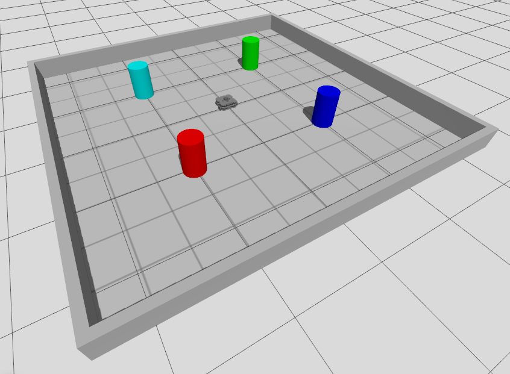{width=600px}
</figure>

## Working with Cameras and Images in ROS

### Camera Topics and Data

There are a number of tools that we can use to view the live images that are being captured by a robot's camera in ROS. As with all robot data, these streams are published to *topics*, so we firstly need to identify those topics.

In a new terminal instance (**TERMINAL 2**), run `ros2 topic list` to see the full list of topics that are currently active on our system. Conveniently, all the topics related to our robot's *camera* are prefixed with `/camera`! Filter the `ros2 topic list` output using `grep` (a Linux command), to only show topics with this prefix:

```bash
ros2 topic list | grep /camera
```

This should provide the following filtered list:

``` { .txt .no-copy }
/camera/camera_info
/camera/image_raw
/camera/image_raw/compressed
/camera/image_raw/compressedDepth
/camera/image_raw/theora
/camera/image_raw/zstd
```

The main item that we're interested in here is the *raw image data*, and the key topic that we'll therefore be using here is:

``` { .txt .no-copy }
/camera/image_raw
```

Run `ros2 topic info` on this to identify the interface used by this topic.

Then, run `ros2 interface show` on the *interface* to learn about the data format. You should end up with an output that looks like this (simplified slightly here):

``` { .txt .no-copy }
# This message contains an uncompressed image
# (0, 0) is at top-left corner of image

std_msgs/Header header # Header timestamp should be acquisition time of image
        builtin_interfaces/Time stamp
                int32 sec
                uint32 nanosec
        string frame_id

uint32 height                # image height, that is, number of rows
uint32 width                 # image width, that is, number of columns

string encoding       # Encoding of pixels -- channel meaning, ordering, size
                      # taken from the list of strings in include/sensor_msgs/image_encodings.hpp

uint8 is_bigendian    # is this data bigendian?
uint32 step           # Full row length in bytes
uint8[] data          # actual matrix data, size is (step * rows)
```

<a name="cam_img_questions"></a>

!!! question "Questions"
    1. What *type* of interface is used by this topic, and which *package* is this derived from?
    1. Using `ros2 topic echo` and the information about the topic message (as shown above) determine the *size* of the images that our robot's camera will capture (i.e. its *dimensions*, in pixels).  It will be quite important to know this when we start manipulating these camera images later on. 
    1. Finally, considering the list above again, which part of the message do you think contains the *actual image data*?

### Visualising Camera Streams {#viz}

We can *view* the images being streamed to the above camera topic (in real-time) in a variety of different ways, and we'll explore a couple of these now.

One way is to use *RViz*, which can be launched using the following `ros2 launch` command in **TERMINAL 2**:

```bash
ros2 launch tb3_tools rviz.launch.py environment:=sim
```

Once RViz launches, you should see a camera panel in the bottom-left corner with a live stream of the images being obtained from the robot's camera.

<figure markdown>
  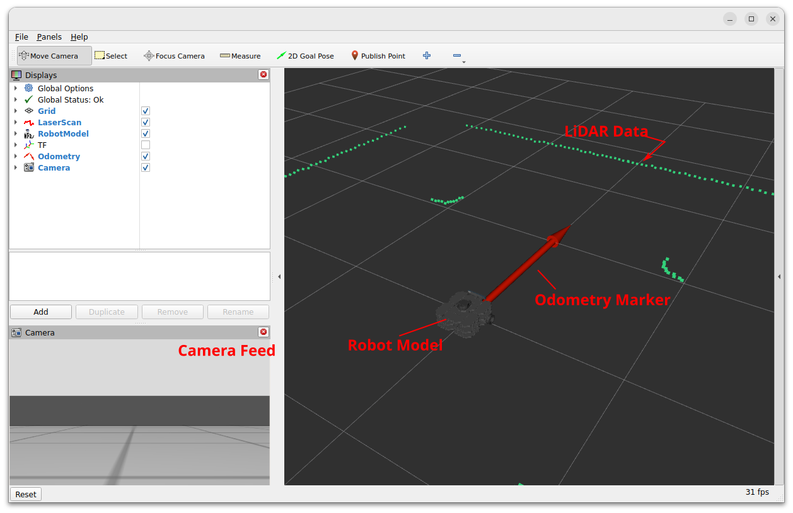{width=800px}
</figure>

Close down RViz by entering ++ctrl+c++ in **TERMINAL 2**.  

#### Exercise 1: Using RQT whilst changing the robot's viewpoint {#ex1}

Another tool we can use to view camera data-streams is *RQT*.

1. Enter the following command in **TERMINAL 2** to launch it:

    ```bash
    rqt
    ```
    <figure markdown>
      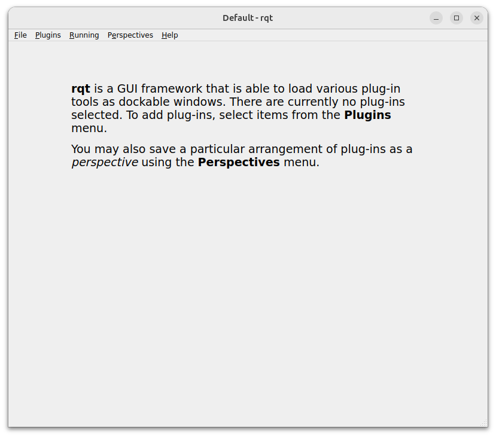{width=600}
    </figure>

1. From the top menu select `Plugins` > `Vizualisation` > `Image View`.

    <figure markdown>
      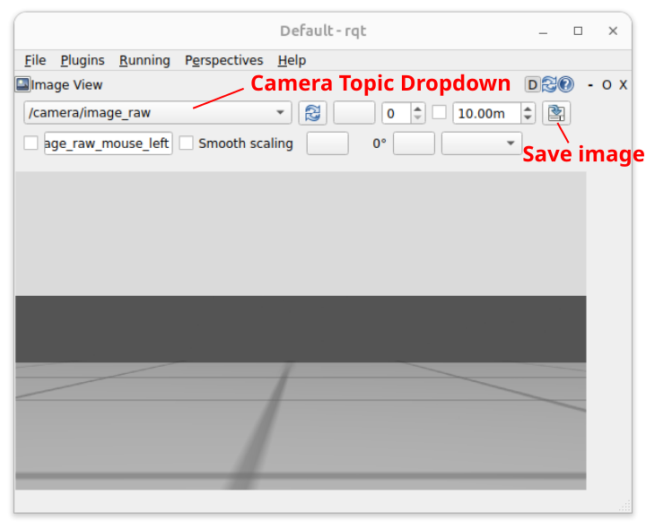{width=500px}
    </figure>

    This allows us to easily view images that are being published to any camera topic on the ROS network. Another useful feature is the ability to save these images (as `.jpg` files) to the filesystem: See the "Save image" button highlighted in the figure above. This might be useful later on...

1. Click the drop-down box in the top left of the window to select an image topic to display.  Select `/camera/image_raw` (if it's not already selected).

1. Keep this window open now, and launch a new terminal instance (**TERMINAL 3**).

1. Launch the `teleop_keyboard` node. Rotate the robot on the spot, keeping an eye on the RQT Image View window as you do this. Stop the robot once one of the coloured pillars in the arena is roughly in the centre of the robot's field of vision, then close the `teleop_keyboard` node and RQT Image View by entering ++ctrl+c++ in **TERMINAL 3** and **TERMINAL 2** respectively.

## OpenCV and ROS {#opencv}

[OpenCV](https://opencv.org/){target="_blank"} is a mature and powerful computer vision library designed for performing real-time image analysis, and it is therefore extremely useful for robotic applications.  The library is cross-platform and there is a Python API (`cv2`), which we'll be using to do some computer vision tasks of our own during this lab session. While we can work with OpenCV using Python straight away (via the API), the library can't directly interpret the native image format used by the ROS, so there is an *interface* that we need to use.  The interface is called [CvBridge](http://wiki.ros.org/cv_bridge){target="_blank"}, which is a *ROS package* that handles the conversion between ROS and OpenCV image formats.  We'll therefore need to use these two libraries (OpenCV and CvBridge) hand-in-hand when developing ROS nodes to perform computer vision related tasks.

### Object Detection

One common job that we often want a robot to perform is *object detection*, and we will illustrate how this can be achieved using OpenCV tools for *colour filtering*, to detect the coloured pillar that your robot should now be looking at.  

#### Exercise 2: Object Detection {#ex2}

In this exercise you will learn how to use OpenCV to capture images, filter them and perform other analysis to confirm the presence and location of features that we might be interested in.

##### Step 1: Getting Started

1. First create a new package called `part6_vision` using [the usual approach](./part1.md#ex4). 

1. Navigate into the `scripts` directory of this new package (using `cd`), create a new file called `object_detection.py` (using `touch`), make this executable (`chmod`) and declare this as an executable in the package's `CMakeLists.txt` (you've done this lots of times now, but check back through previous parts of the course if you need a reminder on how to do any of it).

1. Open up the `object_detection.py` Python file in VS Code, and take a look at the following code:

    <center>[:material-file-code-outline: The `object_detection.py` code](./part6/object_detection.md){ .md-button target="_blank" }</center>

    Read the annotations so that you understand how the node works and what should happen when you run it!

1. Copy the code into the empty `object_detection.py` file and save it.

1. Build the package with `colcon`:

    1. In **TERMINAL 2**, make sure you're in the root of the Workspace:
        
        ```bash
        cd ~/ros2_ws/
        ```

    1. Run `colcon build`:

        ```bash
        colcon build --packages-select part6_vision --symlink-install 
        ```

    1. And finally re-source the `.bashrc`:

        ```bash
        source ~/.bashrc
        ```

1. Run the node using `ros2 run ...` 
    
    An image should appear from the robot's camera and then vanish again after a few seconds.
    
1. As you should know from reading the explainer, the node has just saved this image to a location on your filesystem. Navigate to this filesystem location and view the image using `eog`.

    What you may have noticed from the terminal output when you ran the `object_detection.py` node is that the robot's camera captures images at a native size of 1080x1920 pixels.  That's over *2 million pixels* in total in a single image (2,073,600 pixels per image, to be exact), each pixel having a blue, green and red value associated with it - so that's a lot of data in a single image file! 

    !!! question
        The size of the image file (in bytes) was actually printed to the terminal when you ran the `object_detection.py` node. Did you notice how big it was exactly?

Processing an image of this size is therefore hard work for a robot: any analysis we do will be slow and any raw images that we capture will occupy a considerable amount of storage space. The next step then is to reduce this down by cropping the image to a more manageable size.

##### Step 2: Cropping 

We're going to modify the `object_detection.py` node now to:

* Capture a new image in its native size
* Crop it down to focus in on a particular area of interest
* Save both of the images (the cropped one should be much smaller than the original)  

<a name="step2"></a>

1. In your `object_detection.py` node locate the line:

    ``` { .python .no-copy}
    self.show_image(img=cv_img, img_name="step1_original")
    ```

1. **Underneath this**, add the following additional lines of code:

    ```python
    crop_width = width - 400
    crop_height = 400
    crop_y0 = int((width / 2) - (crop_width / 2))
    crop_z0 = int((height / 2) - (crop_height / 2))
    cropped_img = cv_img[crop_z0:crop_z0+crop_height, crop_y0:crop_y0+crop_width]

    self.show_image(img=cropped_img, img_name="step2_cropping")
    ```

1. Run the node again.  

    You'll be presented with *two* image windows now, but **be patient**! You'll have to wait for a few seconds for each window to open!

    Navigate back to the directory where the images have been saved, and use `eog` again to view them and take a closer look.
    

The code that we've just added here has created a new image object called `cropped_img` from a subset of the original (`cv_img`). This was achieved by specifying a desired `crop_height` and `crop_width` relative to the original image dimensions (in pixels). Additionally, we've also specified *where* in the original image (in terms of pixel coordinates) we want this subset to start, using `crop_y0` and `crop_z0`. This process is illustrated in the figure below:

<figure markdown>
  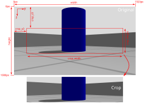{width=600px}
</figure>

<a name="img_cropping" ></a>The original image (`cv_img`) is cropped using a process called *"slicing"*:

``` { .python .no-copy }
cropped_img = cv_img[
    crop_z0:crop_z0+crop_height,
    crop_y0:crop_y0+crop_width
]
```
This may seem quite confusing, but hopefully the figure below illustrates what's going on here:

<figure markdown>
  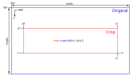{width=500px}
</figure>

##### Step 3: Masking

As discussed above, an image is essentially a series of pixels each with a blue, green and red value associated with it to represent the actual image colours. From the original image that we have just obtained and cropped, we *now* want to get rid of any colours other than those associated with the pillar that we want the robot to detect. We therefore need to apply a *filter* to the pixels, which we will ultimately use to discard any pixel data that isn't related to the coloured pillar, whilst retaining data that is.  

This process is called *masking* and, to achieve this, we need to set some colour thresholds. This can be difficult to do in a standard Blue-Green-Red (BGR) or Red-Green-Blue (RGB) colour space, and you can see a good example of this in [this article from RealPython.com](https://realpython.com/python-opencv-color-spaces/){target="_blank"}.  We'll apply some steps discussed in this article to convert our cropped image into a [Hue-Saturation-Value (HSV)](https://en.wikipedia.org/wiki/HSL_and_HSV){target="_blank"} colour space instead, which makes the process of colour masking a bit easier.

1. First, analyse the *Hue* and *Saturation* values of the cropped image. To do this, navigate to the `~/object_detection` directory, where the raw images are all being saved:

    ```bash
    cd ~/object_detection
    ```
    
    Then, run the following ROS Node (from the `examples` package), supplying the name of the cropped image as an additional argument:<a name="img_cols_node"></a>
    
    ```bash
    ros2 run examples image_colours.py step2_cropping.jpg
    ```
    
1. The node should produce a scatter plot, illustrating the Hue and Saturation values of each of the pixels in the image. Each data point in the plot represents a single image pixel and each is coloured to match its RGB value:

    <figure markdown>
      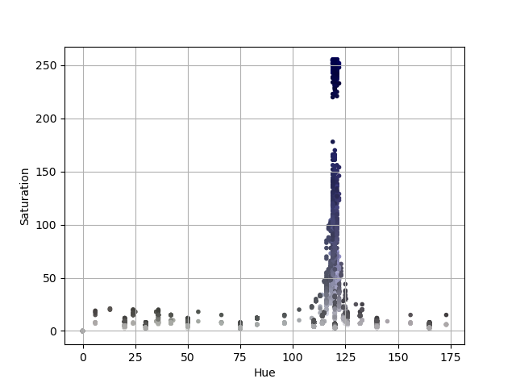{width=600px}
    </figure>

1. You should see from the image that all the pixels related to the coloured pillar that we want to detect are clustered together.  We can use this information to specify a range of Hue and Saturation values that can be used to mask our image: filtering out any colours that sit outside this range and thus allowing us to isolate the pillar itself. The pixels also have a *Value* (or *"Brightness"*), which isn't shown in this plot. As a rule of thumb, a range of brightness values between 100 and 255 generally works quite well.

    <figure markdown>
      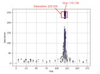{width=600px}
    </figure>

    In this case then, we select upper and lower HSV thresholds as follows:

    ```python
    lower_threshold = (115, 225, 100)
    upper_threshold = (130, 255, 255)
    ```

    Use the plot that you have generated yourself to determine *your own* upper and lower thresholds. <a name="bw_and"></a>

    OpenCV contains a built-in function to detect which pixels of an image fall within a specified HSV range: `cv2.inRange()`.  This outputs a matrix, the same size and shape as the number of pixels in the image, but containing only `True` (`1`) or `False` (`0`) values, illustrating which pixels *do* have a value within the specified range and which don't.  This is known as a *Boolean Mask* (essentially, a series of ones or zeroes).  We can then apply this mask to the image, using a [Bitwise AND](https://en.wikipedia.org/wiki/Bitwise_operation#AND){target="_blank"} operation, to get rid of any image pixels whose mask value is `False` and keep any flagged as `True` (or *in range*).

1. To do this, first locate the following line in your `object_detection.py` node:

    ``` { .python .no-copy }
    self.show_image(img=cropped_img, img_name="step2_cropping")
    ```

1. Underneath this, add the following:

    ```python
    hsv_img = cv2.cvtColor(cropped_img, cv2.COLOR_BGR2HSV)
    lower_threshold = (115, 225, 100)
    upper_threshold = (130, 255, 255)
    img_mask = cv2.inRange(hsv_img, lower_threshold, upper_threshold)

    self.show_image(img=img_mask, img_name="step3_image_mask")
    ```

1. Now, run the node again. A *third* image should also be generated now. 
    
    As shown in the figure below, the third image should simply be a black and white representation of the cropped image, where the white regions should indicate the areas of the image where pixel values fall within the HSV range specified earlier. 
    
    Notice (from the text printed to the terminal) that the cropped image and the image mask have the same dimensions, but the image mask file has a significantly smaller file size.  While the mask contains the same *number* of pixels, these pixels only have a value of `1` or `0`, whereas - in the cropped image of the same pixel size - each pixel has a Red, Green and Blue value: each ranging between `0` and `255`, which represents significantly more data.

    <figure markdown>
      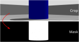{width=600px}
    </figure>

##### Step 4: Filtering {#bitwise_and}

Finally, we can apply this mask to the cropped image, generating a final version of it where only pixels marked as `True` in the mask retain their RGB values, and the rest are simply removed.  [As discussed earlier](#bw_and), we use a *Bitwise AND* operation to do this and, once again, OpenCV has a built-in function to do this: `cv2.bitwise_and()`.

1. Locate the following line in your `object_detection.py` node:

    ``` { .python .no-copy }
    self.show_image(img=img_mask, img_name="step3_image_mask")
    ```

1. And, underneath this, add the following:

    ```python
    filtered_img = cv2.bitwise_and(cropped_img, cropped_img, mask = img_mask)

    self.show_image(img=filtered_img, img_name="step4_filtered_image")
    ```

1. Run this node again, and a fourth image should also be generated now, this time showing the cropped image taken from the robot's camera, but only containing data related to coloured pillar, with all other background image data removed (and rendered black):

    <figure markdown>
      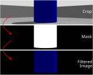{width=600px}
    </figure>

### Image Moments

You have now successfully isolated an object of interest within your robot's field of vision, but perhaps we want to make our robot move towards it, or - conversely - make our robot navigate around it and avoid crashing into it!  We therefore also need to know the *position* of the object in relation to the robot's viewpoint, and we can do this using **image moments**.

The work we have just done above led to us obtaining what is referred to as a *colour blob*.  OpenCV also has built-in tools to allow us to calculate the *centroid* of a colour blob like this, allowing us to determine where exactly within an image the object of interest is located (in terms of pixels).  This is done using the principle of *image moments*: essentially statistical parameters related to an image, telling us how a collection of pixels (i.e. the blob of colour that we have just isolated) are distributed within it. [You can read more about Image Moments here](https://theailearner.com/tag/image-moments-opencv-python/){target="_blank"}. Using this process, the central coordinates of a colour blob can be obtained by considering some key moments of the *image mask* that we obtained from thresholding earlier:

* $M_{00}$: the sum of all non-zero pixels in the image mask (i.e. the size of the colour blob, in pixels)
* $M_{10}$: the sum of all the non-zero pixels in the horizontal (y) axis, weighted by *row* number
* $M_{01}$: the sum of all the non-zero pixels in the vertical (z) axis, weighted by *column* number

!!! info "Remember"
    We refer to the *horizontal* as the *y-axis* and the *vertical* as the *z-axis* here, to match the terminology that we have used previously to define [our robot's principal axes](./part2.md#principal-axes).

We don't really need to worry about the derivation of these moments too much though.  OpenCV has a built-in `moments()` function that we can use to obtain this information from an image mask (such as the one that we generated earlier):

```python
m = cv2.moments(img_mask)
```

So, using this we can obtain the `y` and `z` coordinates of the blob centroid quite simply:

```python
cy = m['m10']/(m['m00']+1e-5)
cz = m['m01']/(m['m00']+1e-5) 
```

!!! question
    We're adding a very small number to the $M_{00}$ moment here to make sure that the divisor in the above equations is never zero and thus ensuring that we never get caught out by any "divide-by-zero" errors. Why might this be necessary?

<figure markdown>
  {width=600px}
</figure>

Once again, there is a built-in OpenCV tool that we can use to add a circle onto an image to illustrate the centroid location within the robot's viewpoint: `cv2.circle()`.  This is how we produced the red circle that you can see in the figure above.  You can see how this is implemented here:

<center>[:material-file-code-outline: A complete worked example of the `object_detection.py` node](./part6/object_detection_complete.md){ .md-button target="_blank" }</center> 

In our case, we can't actually change the position of our robot in the z axis, so the `cz` centroid component here might not be that important to us for navigation purposes.  We may however want to use the centroid coordinate `cy` to understand where a feature is located *horizontally* in our robot's field of vision, and use this information to turn towards it (or away from it, depending on what we are trying to achieve).  We can then use this as the basis for some real **closed-loop** control.

#### Exercise 3: Using Image Moments for Robot Control {#ex3}

Inside the `examples` package there is a node that has been developed to illustrate how all the OpenCV tools that you have explored so far could be used to search an environment and stop a robot when it is looking directly at an object of interest. All the tools that are used in this node should be familiar to you by now, and in this exercise you're going to make a copy of this node and modify it to enhance its functionality.

Make sure the "Coloured Pillars" world is still active and continue with the following steps now in **TERMINAL 2**.

1. The node is called `colour_search.py`, and it is located in the `scripts` folder of the `examples` package. Copy this into the `scripts` folder of your own `part6_vision` package by first ensuring that you are located in the desired destination folder:

    ```bash
    cd ~/ros2_ws/src/part6_vision/scripts
    ```
    
1. Then, copy the `colour_search.py` node using `cp` as follows:

    ```bash
    cp ~/ros2_ws/src/ros/examples/scripts/colour_search.py ./
    ```

1. Open up the `colour_search.py` file in VS Code to view the content.  Have a look through it and see if you can make sense of how it works.  The overall structure should be fairly familiar to you by now: we have a Python class structure, a Subscriber with a callback function, a timer with a callback containing all the robot control code, and a lot of the OpenCV tools that you have explored so far in this part of the course.  Essentially this node functions as follows:
    1. The robot turns on the spot whilst obtaining images from its camera (by subscribing to the `/camera/image_raw` topic).
    1. Camera images are obtained, cropped, then a threshold is applied to the cropped images to detect the blue pillar in the simulated environment.
    1. If the robot can't see a blue pillar then it turns on the spot **quickly**.
    1. Once detected, the centroid of the blue blob representing the pillar is calculated to obtain its current *location* in the robot's viewpoint.
    1. As soon as the blue pillar comes into view the robot starts to turn more **slowly** instead.
    1. The robot **stops** turning as soon as it determines that the pillar is situated directly in front of it (determined using the `cy` component of the blue blob centroid).
    1. The robot then **waits** for a while and then starts to turn again.
    1. The whole process repeats until it finds the blue pillar once again.

1. Add the `colour_search.py` node to the list of Python executables in your `part6_vision/CMakeLists.txt` file.

1. Add the following additional dependency to your `part6_vision/package.xml`:

    ```xml
    <exec_depend>geometry_msgs</exec_depend>
    ```

1. Re-build your package with `colcon`.

1. Run the node as it is to see this in action.  Observe the log messages as they are printed to the terminal throughout execution.

1. **Your task** is to then modify the node so that it stops in front of *every coloured pillar* in the arena (there are four in total, each of a different colour, as you know). For this, you may need to use some of the methods that you have explored in the previous exercises.
    1. You might first want to use some of the methods that we used to obtain and analyse some images from the robot's camera:
        1. Use the `teleop_keyboard` node to manually move the robot, making it look at every coloured pillar in the arena individually.
        1. Run the `object_detection.py` node that you developed in the previous exercise to capture an image, crop it, save it to the filesystem and then feed this cropped image into the `image_colours.py` node from the `examples` package ([as you did earlier](#img_cols_node))
        1. From the plot that is generated by the `image_colours.py` node, determine some appropriate HSV thresholds to apply for each coloured pillar in the arena.
    1. Once you have the right thresholds, then you can add these to your `colour_search.py` node so that it has the ability to detect *every* pillar in the same way that it currently detects the blue one.

### PID Control and Line Following {#pid}

Line following is a handy skill for a robot to have! We can achieve this on our TurtleBot3 using its camera system and the image processing techniques that have been covered so far in this session.

A well established algorithm for closed-loop control is known as **PID Control**, and this can be used to achieve such line following behaviour.

At the heart of this is the principle of *Negative-Feedback* control, which considers a **Reference Input**, a **Feedback Signal** and the **Error** between these.

<a name="neg_fdbck_ctrl"></a>

<figure markdown>
  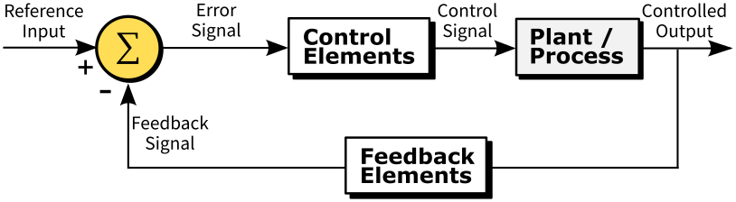{width=500}
  <figcaption>
    Negative-Feedback Control<br />
    Adapted from <a href="https://commons.wikimedia.org/wiki/File:PID_en.svg">Arturo Urquizo</a>, <a href="https://creativecommons.org/licenses/by-sa/3.0">CC BY-SA 3.0</a>, via Wikimedia Commons</a>
  </figcaption>
</figure>

The **Reference Input** represents a desired state that we would like our system to maintain. If we want our TurtleBot3 to successfully follow a coloured line on the floor, we will need it to keep the colour blob that represents that coloured line in the centre of its view point at all times. The *desired state* would therefore be to maintain the `cy` centroid of the colour blob in the centre of its vision.

A **Feedback Signal** informs us of what the current state of the system actually is. In our case, this feedback signal would be the real-time location of the coloured line in the live camera images, i.e. its `cy` centroid (obtained using processing methods such as those covered in Exercise 3 above). 

The difference between these two things is the **Error**, and the PID control algorithm provides us with a means to control this error and minimise it, so that our robot's *actual* state matches the *desired* state. i.e.: the coloured line is always in the centre of its viewpoint.

<a name="pid_terms"></a>

<figure markdown>
  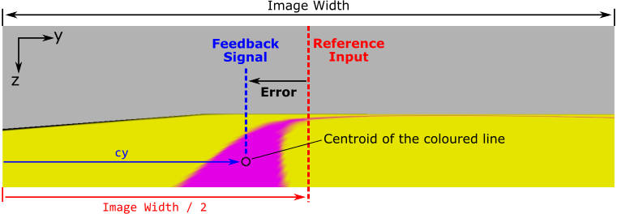{width=700px}
</figure>

<a name="pid_eqn"></a>

The PID algorithm is as follows:

$$
u(t)=K_{P} e(t) + K_{I}\int e(t)dt + K_{D}\dfrac{d}{dt}e(t)
$$

Where $u(t)$ is the **Controlled Output**, $e(t)$ is the **Error** (as illustrated in the figure above) and $K_{P}$, $K_{I}$ and $K_{D}$ are Proportional, Integral and Differential **Gains** respectively. These three gains are constants that must be established for any given system through a process called *tuning*. We will explore this tuning process in the practical exercise that follows.

#### Exercise 4: Line Following {#ex4}

##### Part A: Setup {#ex4a}

1. Make sure that all ROS processes from the previous exercise are shut down now, including the `colour_search.py` node, and the Gazebo simulation in **TERMINAL 1**.

1. In **TERMINAL 1** launch a new simulation from the `simulations` package:

    ```bash
    ros2 launch simulations line_following.launch.py tuning:=true
    ```
    
    Your robot should be launched onto a long thin track with a straight pink line painted down the middle of the floor:

    <figure markdown>
      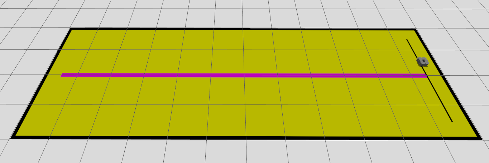{width=800px}
    </figure>

1. In **TERMINAL 2** you should still be located in your `part6_vision/scripts` directory, but if not then go there now:

    ```bash
    cd ~/ros2_ws/src/part6_vision/scripts
    ```

1. Perform the necessary steps to create a new empty Python file called `line_follower.py` and prepare it for execution as a node within your package.

1. Once that's done open up the empty file in VS Code, then have a look at the following code template:
    
    <center>[:material-file-code-outline: The `line_follower.md` code template](./part6/line_follower.md){ .md-button target="_blank" }</center>

    The template contains three "TODOs" that you need to complete, all of which are explained in detail in the code annotations, so read these carefully. Ultimately, you did all of this in [Exercise 2](#ex2), so go back here if you need a reminder on how any of it works. 

    Your aim here is to get the code to generate a cropped image, with the coloured line isolated and located within it, like this:

    <figure markdown>
      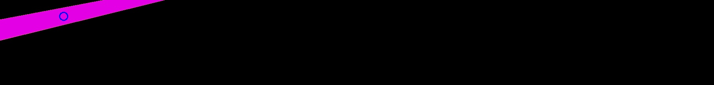
    </figure> 

##### Part B: Implementing and Tuning a Proportional Controller {#ex4b}

Referring back to [the equation for the PID algorithm as discussed above](#pid_eqn), the Proportional, Integral and Differential components all have different effects on a system in terms of its ability to maintain the desired state (the reference input). The gain terms associated with each of these components ($K_{P}$, $K_{I}$ and $K_{D}$) must be *tuned* appropriately for any given system in order to achieve stability of control.

A PID Controller can actually take three different forms:

1. **"P" Control**: Only a *Proportional* gain ($K_{P}$) is used, all other gains are set to zero.
1. **"PI" Control**: *Proportional* and *Integral* gains ($K_{P}$ and $K_{I}$) are applied, the Differential gain is set to zero. 
1. **"PID" Control**: The controller makes use of all three gain terms ($K_{P}$, $K_{I}$ and $K_{D}$)

In order to allow our TurtleBot3 to follow a line, we actually only really need a **"P" Controller**, so our control equation becomes quite simple, reducing to:

$$
u(t)=K_{P} e(t)
$$

The next task then is to adapt our `line_follower.py` node to implement this control algorithm and find a proportional gain that is appropriate for our system.

1. Return to your `line_follower.py` file. Underneath the line that reads:

    ```python
    cv2.waitKey(1)
    ```

    Paste the following additional code:

    ```python
    kp = self.get_parameter('kp').get_parameter_value().double_value
    reference_input = ?
    feedback_signal = cy
    error = feedback_signal - reference_input 

    ang_vel = kp * error
    self.get_logger().info(
        f"\nkp = {kp:.4f},"
        f"\nError = {error:.1f} pixels,"
        f"\nControl Signal = {ang_vel:.2f} rad/s."
    )
    ```

    <a name="blank-1"></a>

    !!! warning "Fill in the Blank!"
        What is the **Reference Input** to the control system (`reference_input`)? Refer to [this figure from earlier](#pid_terms). 

    Here we have implemented our "P" Controller. The **Control Signal** that is being calculated here is the angular velocity that will be applied to our robot (the code won't make the robot move just yet, but we'll get to that bit shortly!) The **Controlled Output** will therefore be the angular position (i.e. the **yaw**) of the robot.  

1. Run the code as it is, and consider the following:

    1. What proportional gain ($K_{P}$) are we applying?
    1. What is [the maximum angular velocity that can be applied to our robot](../about/robots.md#max_vels)? Is the angular velocity that has been calculated actually appropriate?
    1. Is the angular velocity that has been calculated positive or negative? Will this make the robot turn in the right direction and move towards the line?  

1. Let's address the third question (**c**) first...

    A **positive** angular velocity should make the robot turn **anti-clockwise** (i.e. to the left), and a **negative** angular velocity should make the robot turn **clockwise** (to the right).
    
    To start with, the line should be to the left of the robot, which means a **positive** angular velocity is required to make the robot turn towards it. 
    
    If the value of the **Control Signal** that is being calculated by our proportional controller (as printed to the terminal) is negative, then this isn't correct. 
    
    The sign of our proportional gain ($K_{P}$) should be changed in order to correct this. $K_{P}$ is defined in our code as a *Parameter* called `kp`, and if we don't explicitly define a value for this (which so far we have not done) then a default value will be used. We defined this default value in our Node's `#!py __init__()`, when we declared the parameter to begin with:

    ```python
    self.declare_parameter("kp", 0.01)
    ```

    With your node still running, change the value now with a `ros2 param` call from **TERMINAL 3**:

    ```txt
    ros2 param set /line_follower kp -0.01
    ```
    ... the value of the **Control Signal** (i.e. `ang_vel`) should now be greater than zero, which (when velocity commands are actually published) will make the robot turn *left*, i.e. *towards* the line, thereby attempting to *minimise* the position error.

1. Stop the node with ++ctrl+c++. Change the code so that the `declare_parameter()` line now sets the `kp` parameter to be negative by default:

    ```py
    self.declare_parameter("kp", -0.01)
    ```

1. Next, let's address the second of the above questions (**b**)...

    The maximum angular velocity that can be applied to our robot is &plusmn;1.82 rad/s. If our proportional controller is calculating a value for the **Control Signal** that is greater than 1.82, or less than -1.82 then this needs to be limited. **In between** the following two lines of code:

    ``` { .python .no-copy }
    ang_vel = kp * error
    self.get_logger().info(...
    ```

    Insert the following:
    ```python
    if ang_vel < -1.82:
        ang_vel = -1.82
    elif ang_vel > 1.82:
        ang_vel = 1.82
    ```

1. Finally, we need to think about the actual proportional gain that is being applied. This is where we need to *tune* our system by finding a proportional gain ($K_{P}$) value that controls our system appropriately.

    Return to your `line_follower.py` file. **Underneath** the lines that read:

    ``` { .python .no-copy }
    self.get_logger().info(
        f"\nkp = {kp:.4f},"
        f"\nError = {error:.1f} pixels,"
        f"\nControl Signal = {ang_vel:.2f} rad/s."
    )
    ```

    Paste the following:

    ```python
    self.vel_cmd.twist.linear.x = 0.1
    self.vel_cmd.twist.angular.z = ang_vel
    self.vel_pub.publish(self.vel_cmd)
    ```

    Once running, the code *should* now make the robot move with a constant linear velocity of 0.1 m/s at all times, while its angular velocity will be determined by our proportional controller, based on the controller error and the proportional gain parameter `kp`.

    The figure below illustrates the effects different values of proportional gain can have on a system.

    <figure markdown>
      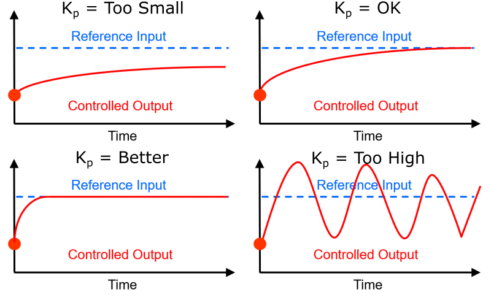{width=600}
      <figcaption>
        Courtesy of <a href="https://www.sheffield.ac.uk/dcs/people/academic/roger-k-moore">Prof. Roger Moore</a><br />
        Taken from COM2009 Lecture 6: PID Control
      </figcaption>
    </figure>

    Run the code and see what happens. You should find that the robot behaves quite erratically, indicating that `kp` (currently at 0.01) is probably too large.

1. Try reducing `kp` by a factor of 100. From **TERMINAL 3**: 
    
    ```txt
    ros2 param set /line_follower kp -0.0001
    ```
    
    With a modified `kp` gain, you should find that the robot now gradually approaches the line, but it can take a while for it to do so.

    !!! tip

        The line that the robot is trying to follow is quite long, but if it gets to the end of it, or if it gets off track and ends up quite far away from the line, then you can always:
        
        1. Stop your `line_following.py` node with ++ctrl+c++.
        1. Launch the `teleop_keyboard` node:

            ```txt
            ros2 run turtlebot3_teleop teleop_keyboard
            ```
        1. Drive the robot back to the line manually.
        1. Stop the `teleop_keyboard` node with ++ctrl+c++ then launch your `line_following.py` node again. 
        
1. Next, increase `kp` by a factor of 10: 
    
    Once again (if you need to), use the `teleop_keyboard` node to get the robot back to the start line. Then, re-launch the `line_follower.py` node.
    
    Update the proportional gain once more with a `ros2 param` call: 
    
    ```txt
    ros2 param set /line_follower kp -0.001
    ```
    
    With this new `kp` gain, the robot should now reach the line much quicker, and follow the line well once it reaches it.

1. Could `kp` be modified any more to improve the control further? Play around a bit more and see what happens. We'll but this to the test on a more challenging track in the next part of this exercise.

##### Part C: Advanced Line Following {#ex4c}

1. Shut down the Line Following *"tuning"* environment if it's still running.

1. Then, in **TERMINAL 1** fire up a new one:

    ```bash
    ros2 launch simulations line_following.launch.py
    ```
    
    Your robot should be launched into an environment with a more interesting line to follow:

    <figure markdown>
      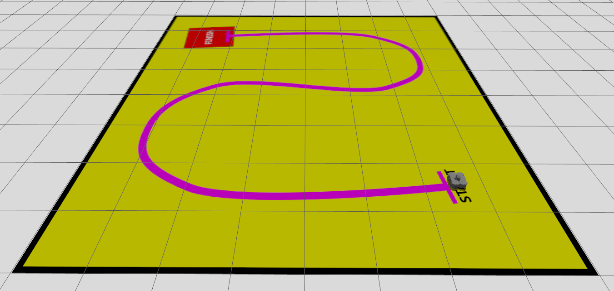{width=800px}
    </figure>

1. In **TERMINAL 2**, run your `line_follower.py` node and see how it performs. Does your proportional gain need to be adjusted further to optimise the performance?

1. Next, think about conditions where the line can't initially be seen...

    As you know, the angular velocity is determined by considering the `cy` component of a colour blob representing the line. What happens in situations where the blob of colour isn't there though?  What influence would this have on the Control Signals that are calculated by the proportional controller? To consider this further, try launching the robot in the same arena but with a different starting pose, and think about how you might approach this situation:

    ```txt
    ros2 launch simulations line_following.launch.py \
        x_pose:=-3 y_pose:=-3 yaw:=-1.57
    ```

1. Finally, what happens when the robot reaches the finish line? How could you add additional functionality to ensure that the robot stops when it reaches this point? What features of the arena could you use to trigger this?

## Submission on Google Classroom

To complete **Lab 6**, you must finish the final obstacle-aware line following challenge and upload your package.

### Final Challenge: The Obstacle-Aware Line Follower

Using the vision and control concepts you've learned, combine line following with obstacle avoidance.

1. **The Goal**: Create a new node (e.g., `obstacle_aware_line_follower.py`) that makes the TurtleBot3 follow a line, but safely stop or steer away if a coloured obstacle blocks its path.
2. **The Logic**: 
    * Process the camera image to detect **two** different colours (the line and the obstacle).
    * Implement a priority-based control system: if the obstacle's size (image moment) exceeds a safe threshold, override the line-following behavior to avoid a collision.
    * If the path is clear, default back to normal PID line following.

### Preparation for Upload

Ensure your `part6_vision` package is correctly compiled, free of build errors, and all Python scripts have executable permissions.

1.  **Clean your workspace**: 
    ```bash
    cd ~/ros2_ws/src/
    ```
2.  **Compress your package**: 
    ```bash
    zip -r part6_submission.zip part6_vision/
    ```

### Submission Checklist

Your `part6_submission.zip` must contain:

* **`scripts/`**: 
    1.  `object_detection.py` (From Exercise 2).
    2.  `colour_search.py` (From Exercise 3).
    3.  `line_follower.py` (From Exercise 4).
    4.  `obstacle_aware_line_follower.py` (**The Final Challenge**).
* **`package.xml`**: Must include all necessary dependencies (e.g., `rclpy`, `sensor_msgs`, `geometry_msgs`, `cv_bridge`).
* **`CMakeLists.txt`**: Correctly configured with all Python scripts listed under the `install(PROGRAMS ...)` block.

**Upload your `part6_submission.zip` to the "Lab 6: Cameras, Machine Vision & OpenCV" assignment on Google Classroom.**